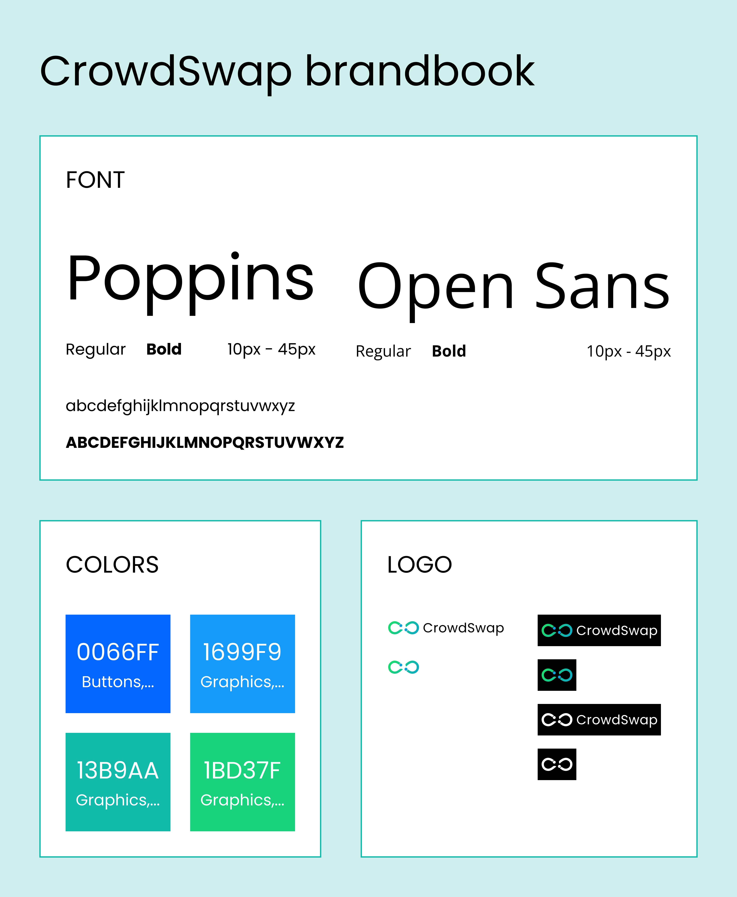

# CrowdSwap brandbook

---

Use the assets provided below.

> [Logo.svg](../.gitbook/assets/Logo.svg "download")

> [Logo with text.svg](../.gitbook/assets/Logo with text.svg "download")

> [Logo.png](../.gitbook/assets/Logo.png "download")

> [Logo with text.png](../.gitbook/assets/Logo with text.png "download")

> [Token icon.svg](../.gitbook/assets/Token_Logo.svg "download")
