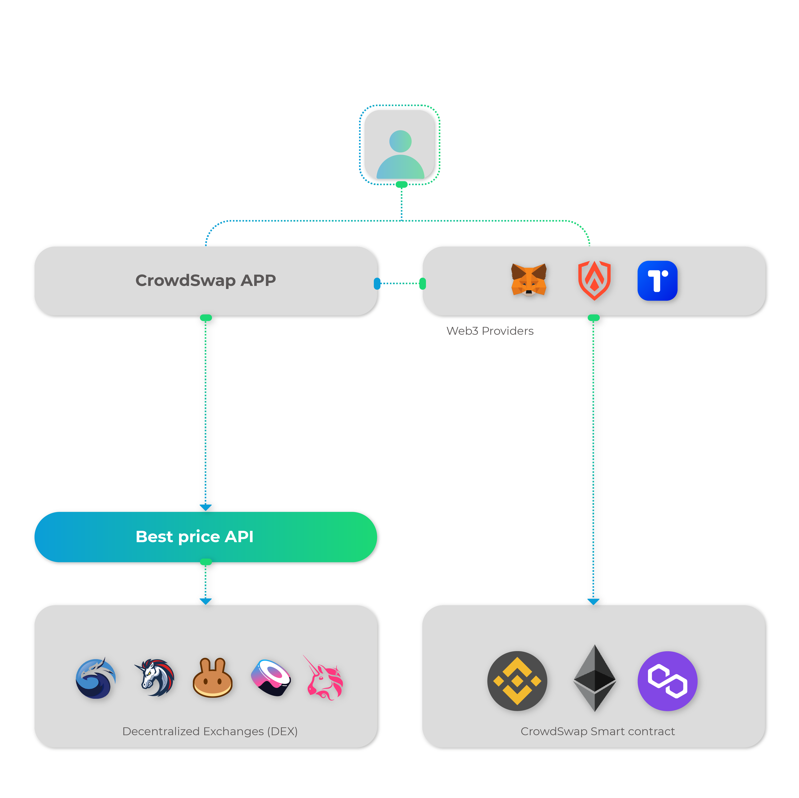

# Architecture

CrowdSwap is the best-price-routing and aggregation protocol for decentralized finance (DeFi). It aims to reach mass adoption in crypto for every human being and overcome actual problems that reside in a fast-growing business space like DeFi.
CrowdSwap concentrates on providing these features:
- Best Price Search Inside Multiple Decentralized Exchanges (like Uniswap, SushiSwap, and more) on different blockchain networks
- On-Chain and Cross-Chain Swap

The following picture illustrates the blueprint of the CrowdSwap architecture and its main parts:
- Front-Office Application
- Web3 Provider and Wallet Connection
- Best Price Router and Dex Aggregator APIs
- Swap Smart Contract

## Front-Office Application

This is a secured SPA application that provides all services for the end-users. It interacts with both the user wallet and the back-end APIs. CrowdSwap uses the web3 library to connect to the user wallet and communicate with the blockchain networks.
We support these networks so far:
- Ethereum
- BSC
- Polygon

The access to the back-end APIs is secured with an SSL certificate.
Web3 Provider and Wallet Connection Support
CrowdSwap app interacts with the user wallet through a Web3 provider that is a data structure providing a link to publicly accessible Ethereum nodes. CrowdSwap app currently supports these providers:
- MetaMask
- Torus
- Authereum

The WalletConnect protocol is also supported. It is the web3 standard to connect blockchain wallets to Dapps.
These wallets allow users to manage private keys and sign transactions within their web browser.

##Best Price Router and Dex Aggregator APIs

DEX aggregators serve as a unified explorer for prices and liquidity offered by decentralized exchanges (DEXs). You can consider this service a search engine that accumulates data from a wide array of decentralized exchanges and facilitates split trades to offer the best possible prices. We have developed algorithms to find the best routing path for a swap. This API can be called with these two methods:
Call from CrowdSwap app inside the user browser
Call using an SDK for a third-party application that integrates with our service
Currently, We support these DEXs:
- Uniswap (Both V2 and V3)
- Sushiswap
- Balancer
- Bancor
- Kyber
- Appswap
- Pancake
- Quickswap

## Swap Smart Contract
When the user wants to swap in our platform, we use an audited smart contract. This smart contract is deployed on all supported networks. This smart contract provides two main functionalities:
Calculate and transfer the platform swap fee
Delegate and call the appropriated DEX based on the best routing price path
