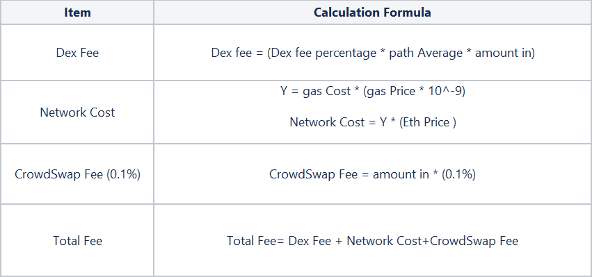
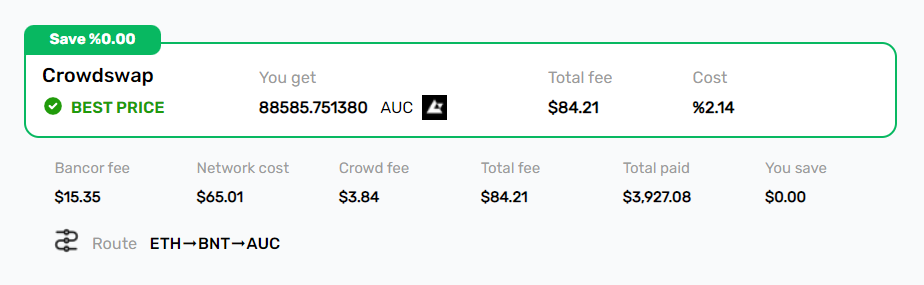

# Protocol

### Fees/Estimation calculation
  
The price of source and destination tokens in USDT is inquired from coingecko or Binance APIs.
The fee of each DEX and network cost are inquired from that DEX. Crowdswap fee is calculated as 0.1% of source price in USDT.
All fees are deducted from destination amount except liquidity provider fee which is deducted from source token amount.

###

* Gas Price: [https://ethgasstation.info/](https://ethgasstation.info/)
* Gas Cost: Historical gas usage of functions in the target DEX
* Amount In USDT: source token amount * source token price in USDT
###
For example, by selecting ETH as source token and AUC as destination token, you can see fees are calculated based on data from estimation.
Keep in mind that by clicking swap button, a new estimation will be performed based on the best price DEX. 

### Supported Networks and DEXes (current state)

* #### Ethereum Network
    * Uniswap V2
    * Uniswap V3
    * Sushiswap
    * Bancor
    * Balancer
    * Kyber
    * Crypto.com
    * Curve v1
####  
* #### BSC Network
    * Pancake
    * Sushiswap
    * Apeswap
    * Biswap
####
* #### Polygon Network
    * Quickswap
    * Sushiswap
    * Uniswap V3
    * Apeswap
####
* #### Avalanche Network
    * Trader Joe
    * Sushiswap
  
### Contracts

* Token: [0x483dd3425278C1f79F377f1034d9d2CaE55648B6](https://polygonscan.com/token/0x483dd3425278C1f79F377f1034d9d2CaE55648B6)
* Distribution: [0xBeDf619c69f5C1655E58463B85A4EE67629dE409](https://polygonscan.com/address/0xBeDf619c69f5C1655E58463B85A4EE67629dE409)
* Staking: [0x3C868fe859eF46a133e032f22B443e6Efd617449](https://polygonscan.com/address/0x3C868fe859eF46a133e032f22B443e6Efd617449)
* Swap
  * Ethereum: [0x467eC2d26Bb7DE784A4584c6762B43eb69e65636](https://etherscan.io/address/0x467eC2d26Bb7DE784A4584c6762B43eb69e65636)
  * BSC: [0xd4560c06db2bAe0b06E9243896aD48e4bD14cdb2](https://bscscan.com/address/0xd4560c06db2bAe0b06E9243896aD48e4bD14cdb2)
  * Polygon: [0xBBc607D84eE5836C802B8b98392C8EAd8B9cDa5D](https://polygonscan.com/address/0xBBc607D84eE5836C802B8b98392C8EAd8B9cDa5D)
  * Avalanche: [0x467eC2d26Bb7DE784A4584c6762B43eb69e65636](https://snowtrace.io/address/0x467eC2d26Bb7DE784A4584c6762B43eb69e65636)
