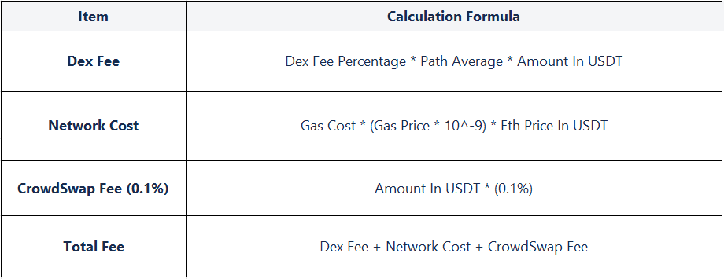

# Protocol

###Fees/Estimation calculation
  
The price of source and destination tokens in USDT is inquired from coingecko or Binance APIs (for more information, refer to [Developer](../developers/guides.md)).
The fee of each DEX and network cost are inquired from that DEX. Crowdswap fee is calculated as 0.1% of source price in USDT.
All fees are deducted from destination amount except liquidity provider fee which is deducted from source token amount.

###

###
For example, by selecting ETH as source token and AUC as destination token, you can see fees are calculated based on data from estimation.
Keep in mind that by clicking swap button, a new estimation will be performed based on the best price DEX. 

###Supported Networks and DEXes

* ####Ethereum Network
    * Uniswap V2
    * Uniswap V3
    * Sushiswap
    * Bancor
    * Balancer
    * Kyber
####  
* ####BSC Network
    * Pancake
    * Sushiswap
    * Apeswap
####
* ####Polygon Network
    * Quickswap
    * Sushiswap
  
###Contracts

* Token: [0x483dd3425278C1f79F377f1034d9d2CaE55648B6](https://polygonscan.com/token/0x483dd3425278C1f79F377f1034d9d2CaE55648B6)
* Distribution: [0xBeDf619c69f5C1655E58463B85A4EE67629dE409](https://polygonscan.com/address/0xBeDf619c69f5C1655E58463B85A4EE67629dE409)
* Swap
  * Ethereum: [0x467eC2d26Bb7DE784A4584c6762B43eb69e65636](https://etherscan.io/address/0x467eC2d26Bb7DE784A4584c6762B43eb69e65636)
  * BSC: [0x467eC2d26Bb7DE784A4584c6762B43eb69e65636](https://bscscan.com/address/0x467eC2d26Bb7DE784A4584c6762B43eb69e65636)
  * Polygon: [0x467eC2d26Bb7DE784A4584c6762B43eb69e65636](https://polygonscan.com/address/0x467eC2d26Bb7DE784A4584c6762B43eb69e65636)