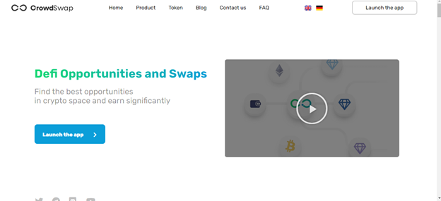
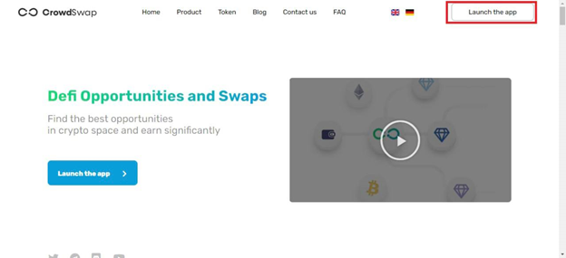
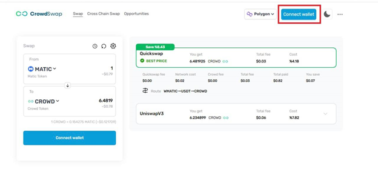
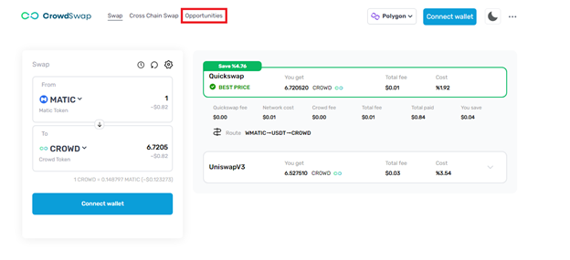
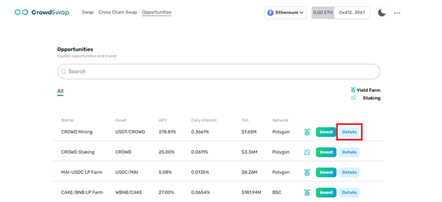
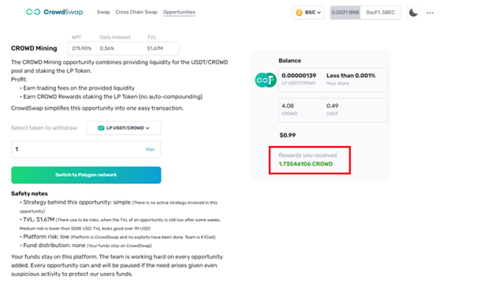

# How can you find out how much you earned from one opportunity?

---

1: Enter to our site: www.crowswap.org

2: Open the CrowdSwap app.

3: Connect your wallet.

4: Click the Opportunities button.

5: In the Opportunities section you can select the sector in which you have invested and click on the Details button.

6: If you click the Details button you can find out how much you earned from your opportunity. (Rewards you received)

