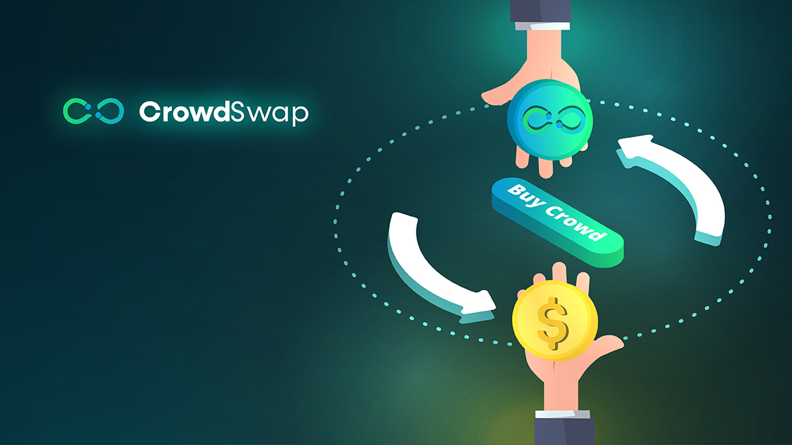
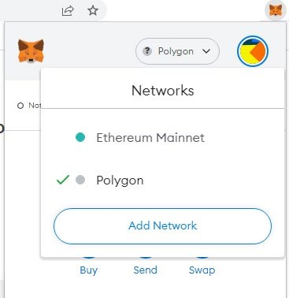
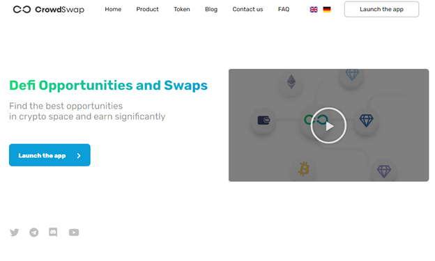
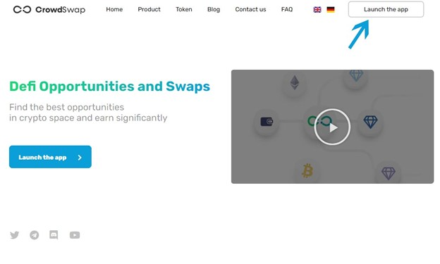
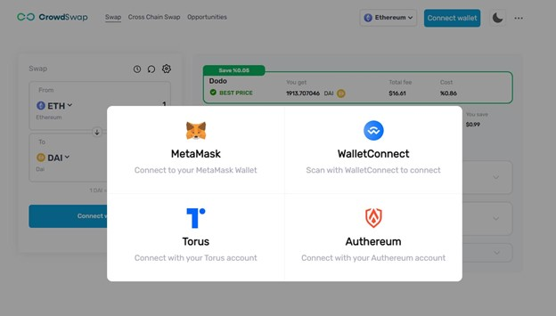
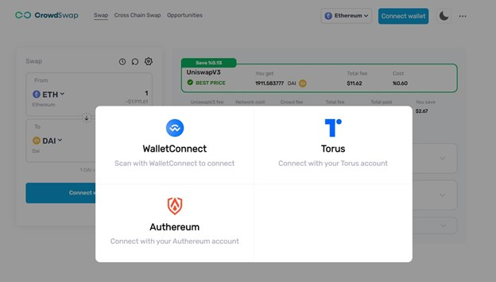
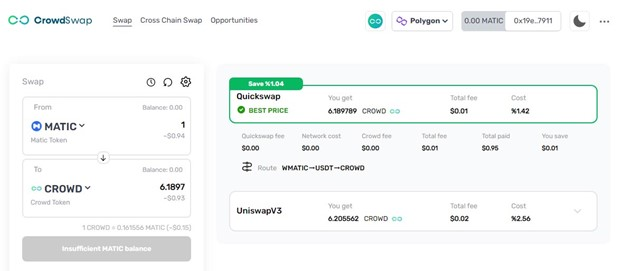

# How to buy crowd (cwd) token?

---

Crowd token is based on polygon network. So for buying CROWD token you need to fund your wallet with ETH or Matic and then follow these easy steps:

Note:  if you don't have any of mentioned cryptos yet, get some from your trusted crypto exchanges and then send it to your Crypto Wallet.

Note: if you don’t have polygon network on your MetaMask, you must first add it as below:

Click on MetaMask extension icon> Settings > Networks and click the add network button on your:

After adding polygon network, you are ready to go forward.

Step 1: Enter to our site: www.crowswap.org

Step 2: Launch the app page www.crowdswap.org/swap

Step 3: Connect your MetaMask wallet  

In app homepage, you will see a pop-up which shows you wallet options that you can connect.

If you don’t have a MetaMask wallet extension, you won’t see it’s icon in the pop-up window.

Step 4: Swap your Matic for Crowd

That’s it. You are done!

Welcome to our community.