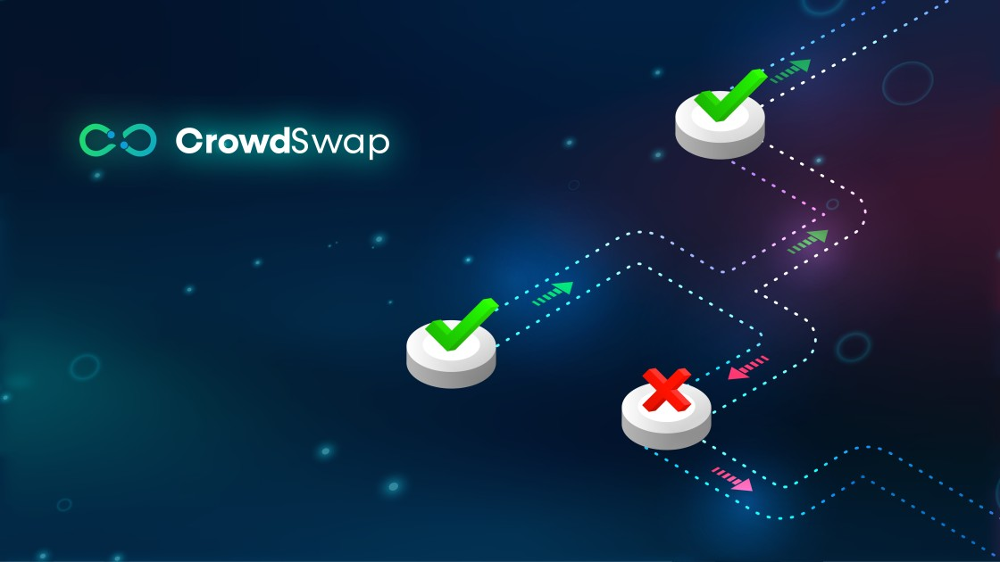
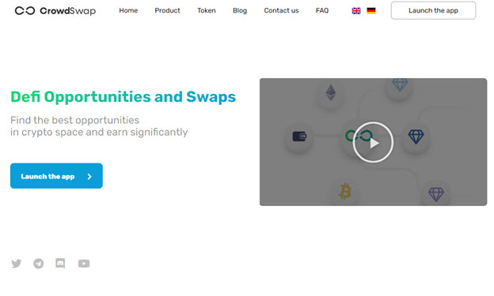
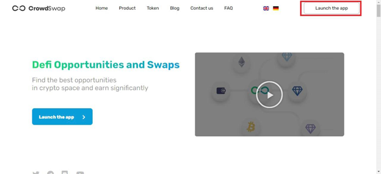
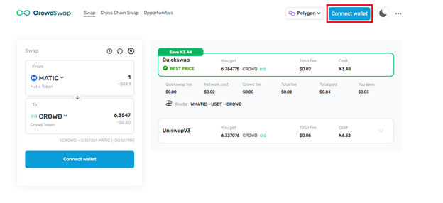
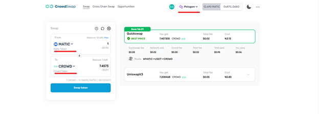
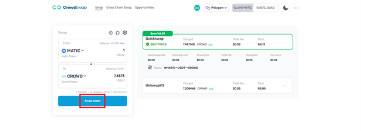
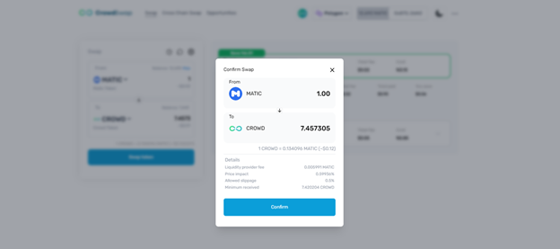
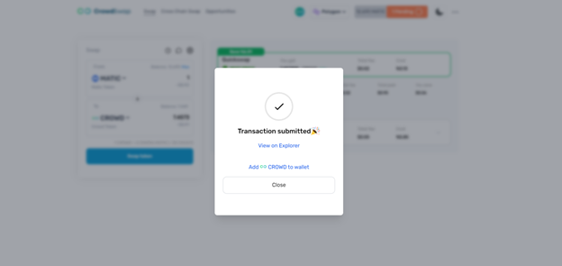

# How to choose best price route for swapping?

---

1: Enter our site: www.crowswap.org

2: Launch the app page www.app.crowdswap.org/swap

3: On this page, you can connect to your wallet.

4: Here you will be able to swap one Token for another Token. You will now need to choose the network and tokens you'd like to swap. Then you can see all routes of compared DEXs transparently.

5: In this step, you can Click the Swap token button.

6: In the next step, the Confirm Swap page will open. Confirm after you have checked.

7: Confirm it on your wallet.

8: This step will show you the confirmation of the transaction.

