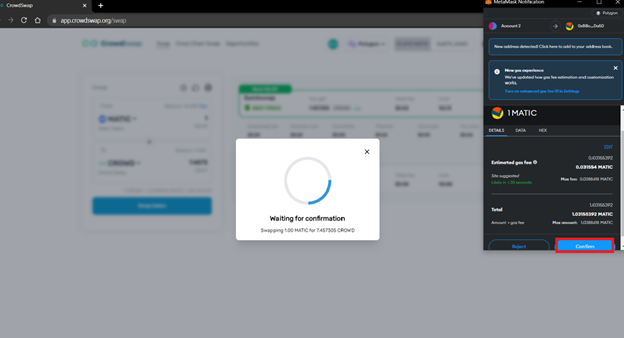

# How to choose best price route for swapping?

---

1: Go to crowswap.org

2: Launch the CrowdSwap app page: www.crowdswap.org/swap

3: On the CrowdSwap app page, you can connect to your wallet.

4: At this step, you will be able to swap one Token for another Token. You will now need to choose the network and tokens and then type in the amount you'd like to swap. Then you can see all routes of compared DEXs transparently.

5: Click the "Swap token" button.

6: If you agree with the details of the service, click the "confirm" button.

7: Confirm it on your wallet.

8: That's it! This step will show you the confirmation of the transaction.

