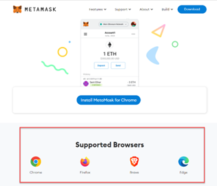
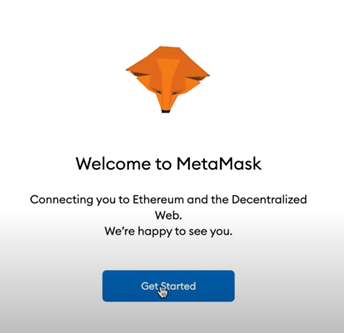
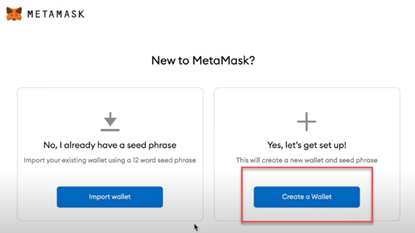
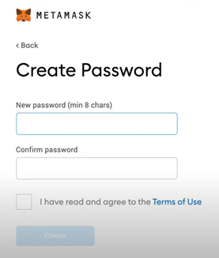
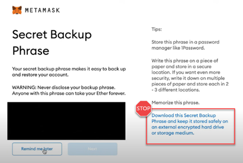
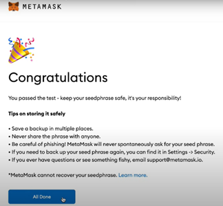

# How to Install MetaMask Web 3 Wallet on Chrome 2023

---

Due to its outstanding features, MetaMask is one of the most popular cryptocurrency wallets on the market today. In addition, it can be connected to a wide range of blockchain networks since it is a gateway to the Web 3 ecosystem of dApps. There are many reasons why many users prefer it over other wallets, such as its easy integration, ease of use, and compatibility across different platforms. These are only a few reasons many users prefer it over other wallets. According to Bloomberg, [with more than 30 million users](https://www.bloomberg.com/news/articles/2022-08-20/ethereum-overhaul-risks-creating-a-new-class-of-crypto-kingpins), MetaMask is the most popular non-custodial wallet in the world.

MetaMask can be easily installed as a Google Chrome extension and used on demand. But before we start, make sure you have a pen and paper at hand to make a backup of your wallet and you secure it somewhere to make sure that nobody but you has access to your recovery key.

**1. Install the MetaMask extension on your browser**

To install the MetaMask extension go to the [MetaMask Download](https://metamask.io/download.html) page and select the appropriate version. You can select to install mobile on iOS or android. This guide will concentrate on the browser setup. Mobile ones should almost be the same.

Scroll down to the section and choose the browser version that you are using.

**2. Create your wallet**

After the successful installation of the MetaMask extension, you can start to create your own wallet.

> Click “Get started”

After following the get started route, you will see this dialog, where you can choose to create your new wallet or import an existing wallet.

> Click “Create a Wallet”

The first step is to create a password for your wallet. It has to have at least 8 characters. 

**<u>Tip: Choose a complex password or use a password generator to create a random password. You are responsible for your assets now!!</u>**

> Enter the password

> Repeat the password to confirm it

> read the “terms of use” and check it

> Click the “create” button 

You will be presented with the recovery phrase. This sequence of words is very important. You need it to import your wallet into the MetaMask extension. So, write it down and confirm this in the dialog

> Write down the sequence of words

> Confirm that you wrote it down somewhere

> Click “Next”

Congratulations! You have successfully created a wallet!

The recovery phrase is the key to your wallet and anybody who has it will have access to your funds. So, make sure you back up your wallet and keep it somewhere safe so that nobody but you has access to your recovery key.
