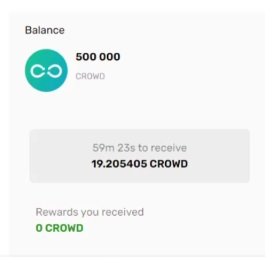

# How to use CROWD staking?

---

To start staking CROWD, you need to navigate to the CrowdSwap app page. In the opportunity section, you will find different DeFi investing solutions. If you connect your wallet to our site, you will see the “Invest” and “Details” buttons in active mode.

By clicking the “Invest” button in the second row, you will see the staking CROWD page.

Please notice; to start staking CROWD, you need to have some Matic in your wallet to pay the transaction fee unless you can’t perform the staking process.

First, you need to allow to use your CROWD. By clicking on the button, you have to give permission to your wallet to use your Matic on pop-up windows.

If you don’t have CROWD token in your wallet, you can use our swap service to get some CROWD.

After these steps, you will see your CROWD token balance in the dialogue box. By clicking on the stake button you can stake your CROWD and get rewards.

Congratulations, you’ve just staked successfully.

On the right side of the screen, you can see your balance and the reward amount you have received, which will be updated every hour.

Keep in mind that you can unstake your CROWD and get your rewards in your wallet any time you want.
