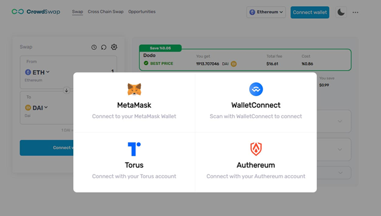

# How to connect your wallet to CrowdSwap app?

---

A: If you’re using a desktop browser to access the website:

1: Enter our site: www.crowswap.org

2: Launch the app page www.crowdswap.org/swap

3: Click the Connect wallet button.

4: In-app homepage, you will see a pop-up that shows you wallet options that you can connect.

-Click [WalletConnect] to display a QR code.

We’ll use this QR code to scan with your WalletConnect-enabled mobile wallet. (You can scan the QR code or find your wallet)

- If you don’t have a MetaMask wallet extension, you won’t see it’s an icon in the pop-up window, first Install the MetaMask extension. Then connect to your MetaMask wallet.

B: If you're using your mobile browser:

1: Click the Launch the app button.

2: Click the Wallet Connect button.

3: You'll see options to Choose your preferred wallet. Select your preferred wallet to connect from the displayed list.

