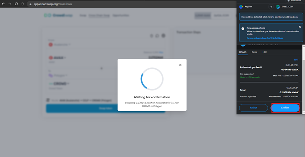

# How to do Cross Chain Swap in CrowdSwap?

---

1: Launch to CrowdSwap app page.

2: Connect your wallet to our site.

3: You will see the Cross Chain Swap button. Click the Cross Chain Swap button.

4: Here you will be able to swap one asset for another. Now you need to choose the networks and tokens you'd like to swap. (Available networks: Ethereum, BSC, Polygon, Avalanche)

5: Then you can click on the swap token button.

6: It will show you how much you'll receive and details of the cross-chain. To make the swap happen all you need to do now is click on confirm button.

7: Now you can see Transaction Steps.

Congratulations.
