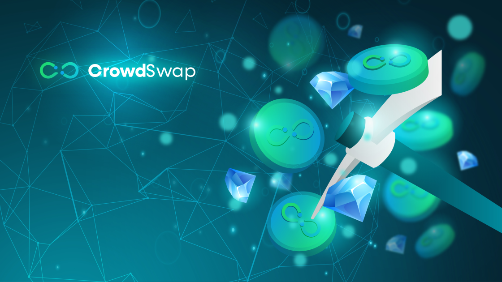
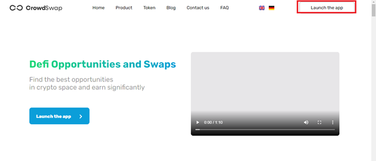
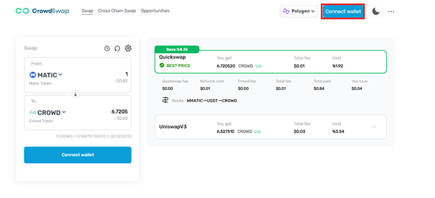
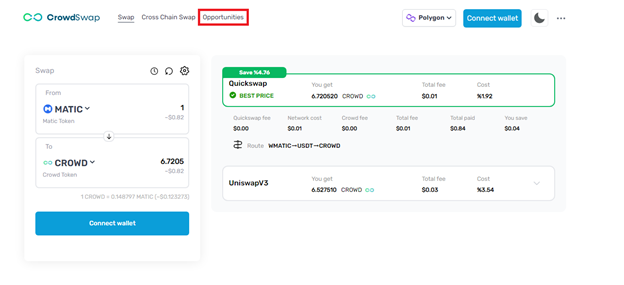
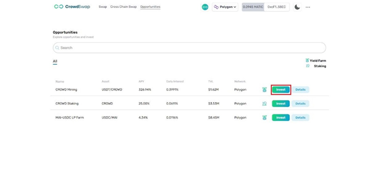
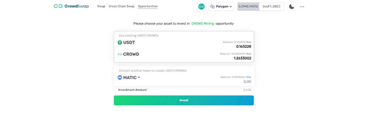
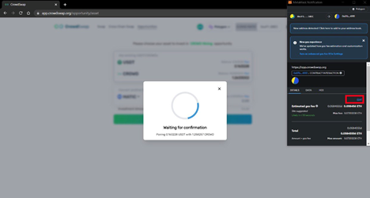
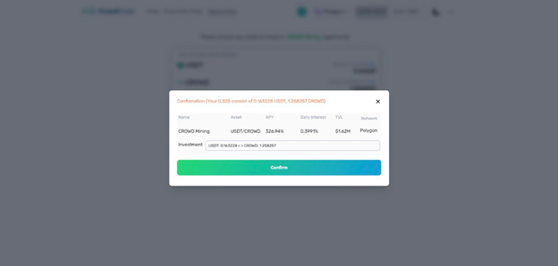
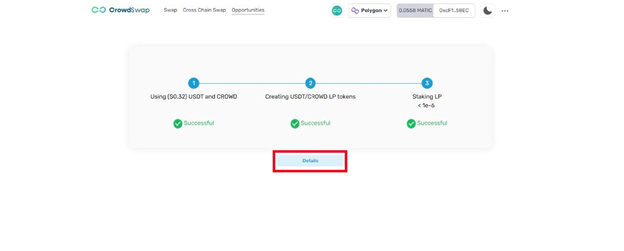
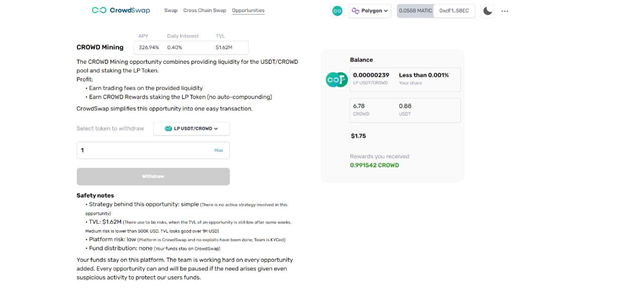

# How to use CROWD Mining?

---

1: Launch CrowdSwap app page.

2: Connect your wallet to our site.

3: You will see the opportunities button. Click the opportunities button.

4: In the Opportunities section you will find different DeFi investing solutions. If you connected your wallet to our site, you will see the “Invest” and “Details” buttons in active mode. By clicking on the "Invest" button in the first row, you will see the CROWD Mining page.

5: Choose your asset to invest in the Crowd Mining opportunity. Then you can Click the invest button. (you can use your USDT and CROWD at equal value and you can also change to convert another token to create USDT and CROWD)

6: Wait for confirmation at this step. (on your Meta Mask Wallet, if you want don't wait very long on Polygon you can Click the edit button On the right side of the screen, choose high transaction fees, and confirm it.)

7: When you confirm it you get the overview page and here you can see the confirm button, you can Click it. Then confirm it on your wallet again.

8: Wait and don’t close the browser until you see the final result. You can Click the details button to see the details.

9: If you Click the Details button you can see the details of the Crowd Mining process. (In each part of the details page, you can see these: balance, rewards, APY, Daily Interest, TVL, name of the opportunity, short description, LP CROWD/USDT or CROWD Reward, and safety notes.)

