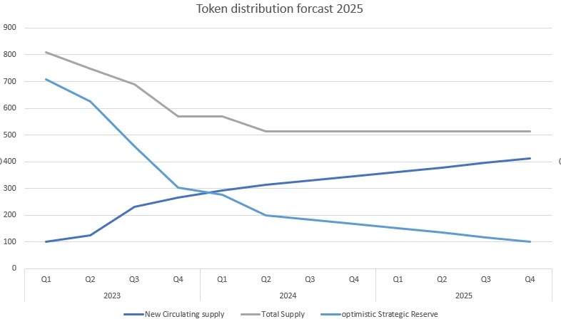
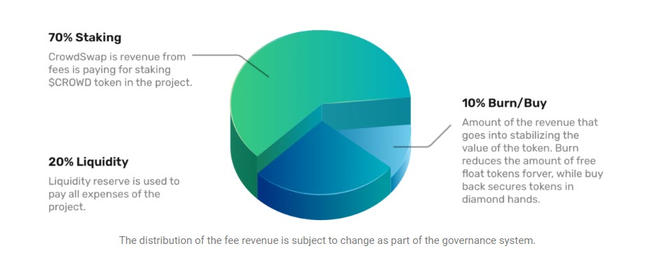

# Tokenomics

CrowdSwap Tokenmocs and Business Model are built around the project developing into a DAO. This section gives you an overview and security as an investor on how CROWD tokens are distributed and used by the project. Furthermore you get an overview of the vested tokens and when those are being released.

## 1. Total vs. Circulating supply forcast 2025

The diagram gives you a fast overview of the Total to circulating supply for the following two years. We will break down the distribution of CROWD based on liquidity usage down below. 

The diagram shows that the circulating supply will exceed 50% of the total supply already beginning of 2024 resulting in 80% at the end of 2025 reducing the risks of investors.

The strategic reserve of the project will go down to aproximately 100M CROWD tokens that will be distributed into the DAO once the pahse starts.

|Category|2023| | | |2024| | | |2025| | | |
|-|-|-|-|-|-|-|-|-|-|-|-|-|
||Q1|  Q2  |    Q3  | Q4|Q1| Q2|  Q3|  Q4|Q1 |Q2 | Q3|  Q4|
|New Circulating supply|100,6	|123,7	|230,8	|266,8|	293,3|	312,8|	329,3	|345,8|	362,3|	378,8	|395,3	|411,8|
|Total Supply|	809	|749	|689	|569|	569|	513|	513	|513|	513	|513	|513	|513|
| optimistic Strategic Reserve|	708,4	|625,3|	458,2|	302,2|	275,7	|200,2	|183,7|	167,2|	150,7	|134,2	|117,7|	101,2|			

## 2.  Breakdown into different categories of distribution

The following table is a breakdown of the planned distribution of CROWD token until 2025 based on liquidity and incentives, payments for advisors and influencers as well as community events and vested tokens (private sale, team & advisors)

|Category|2023| | | |2024| | | |2025| | | |
|-|-|-|-|-|-|-|-|-|-|-|-|-|
||Q1|  Q2  |    Q3  | Q4|Q1| Q2|  Q3|  Q4|Q1 |Q2 | Q3|  Q4|
|**Incentives**|||||||||||
|Staking Incentives*| ||2.5|2.5|2.5|2.5|2.5|2.5|2.5|2.5|2.5|2.5|
|Pool Incentives*||||12|12|12|12|12|12|12|12|12|
Cross-chain Distribution*|||20|50|20|10||||||
|**Payments**||||||||||||
|Advisors|0.2|0.2|0.2|1|1|1|1|1|1|1|1|1|1|
|Influencers|0.5|1|1|1|1|1|1|1|1|1|1|1|
|**Community*****||||||||||||
|Long-term holder||||||3|||||||
|**Vested token distribution**||||||||||||
|Private Sale|||14||||||||||
|Team& Advisors|||40||||0**||||||

1* Unused CROWD token go into DAO treasury

2** Voluntary burn event - Total supply has been reduced as well (keeping ratio) 

3 *** More community events can be planned from strategic reserve

We assume that the revenue the protocol will reach will take over Incentives as needed to provide enough engagement in non active times. Strategic reserve can be used for any purpose but is due to DAO being established and proposals reach executable amount of votes.

Cross-chain: CROWD token are needed as utility in transfer between chains. The distribution started already and will be goind on until Q2 2024. More chains will be integrated. 100M CROWD token should be enough for the  start and will be rebalanced if fragmentation starts to be a problem.

##3. DAO Phase distribution and revenue stream

Once the DAO has started the revevnue stream will be used to secure the mission of the project and it´s supporters. The following numbers are the starting factors and can be changed based on a valid proposal with appropriate voting and absolut majority.

Before any distribution expenses have to be payed!

Staking option will be open to sCROWD holders only.

The liquidity section is used to reward liquidity providers and pay incentives for staking. 

Burn/Buy can be used to reduce the total supply of CROWD further.

Anyway Staking, Liquidity and Burn/Buy streams can be used to buy valuable token from the market and store these as treasury for winter times. This proposal should always be considered voting upon on a monthly basis.
 
